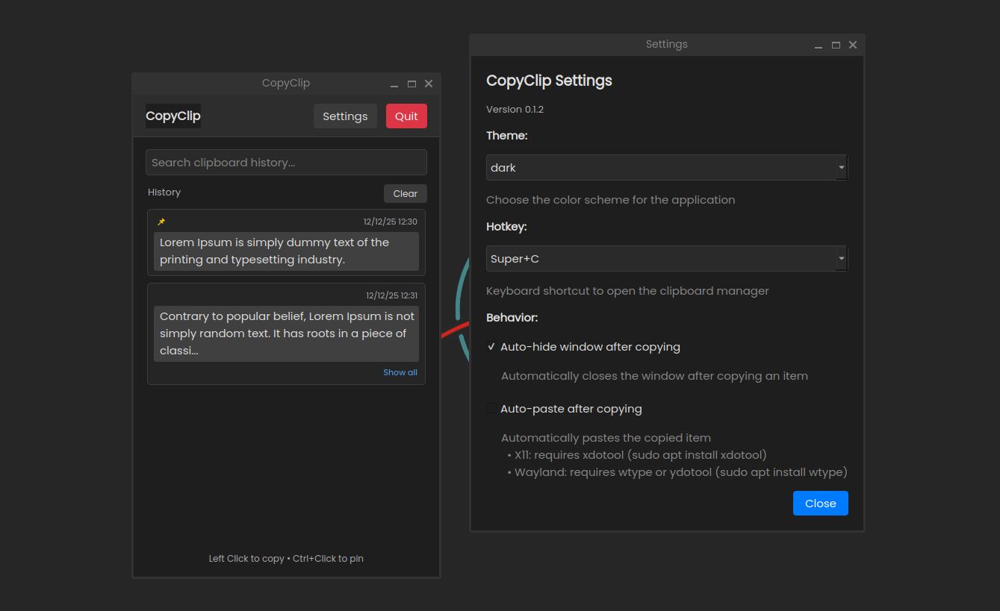
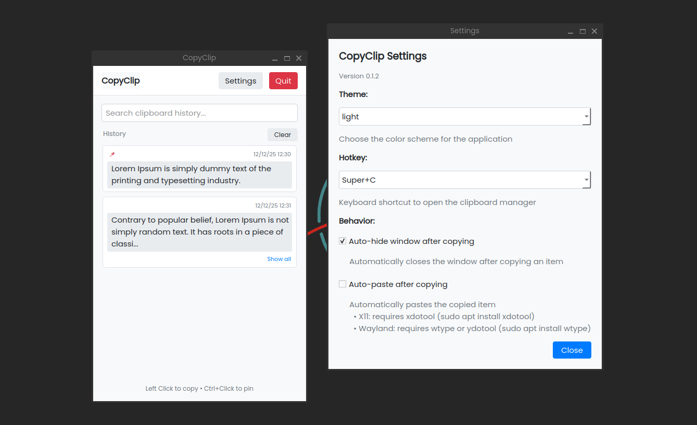

<div align="center">

# 📋 CopyClip  
### A modern, open-source clipboard manager for Linux


[](LICENSE)


[](https://github.com/Walkercito/CopyClip/releases)
[](https://github.com/Walkercito/CopyClip/issues)

</div>

---

## ✨ Overview

**CopyClip** is a lightweight, open-source clipboard manager for Linux, inspired by the Windows 10 clipboard.
It provides fast access to your clipboard history, pinning, search, customizable hotkeys and a clean desktop-friendly UI.

🖥️ **Display Server Support:**
- **X11** — Full support with automatic global hotkeys
- **Wayland** — Functional with manual hotkey setup (GNOME, KDE Plasma tested)

> **Note:** Wayland requires manual keyboard shortcut configuration due to security restrictions. See installation instructions below.

---

## 📸 Screenshots

<div align="center">
  
  <br>
  <i>dark mode with text</i>
  <br><br>
  
  <br>
  <i>light mode with text</i>
</div>


---

## ✨ Key Features

- 🗂️ **Clipboard History** — Automatic history in reverse chronological order
- 📌 **Pin Items** — Keep important clips always visible
- 🎛️ **Custom Hotkeys** — Choose your preferred key binding on first launch
- 🔍 **Instant Search** — Filter items with a built-in search bar
- 🖥️ **Multi-Display Server** — Works on both X11 and Wayland
- 🌗 **Themes** — Dark, light, or system theme
- ⚙️ **Configurable** — Adjust timings, delays, and behavior via settings.json
- 📋 **Auto-paste** — Optional auto-paste after selecting items (X11: xdotool, Wayland: wtype/ydotool)
- 🔄 **Smart Cleanup** — Auto-clear on reboot while preserving pinned items
- 🖼️ **Clean UI** — GNOME-inspired, keyboard-friendly interface  

---

## 📦 Dependencies

**Using the automatic installer?** Skip this section - dependencies are installed automatically.

For manual installation, install these based on your display server:

### Debian / Ubuntu
```bash
# Required for all systems
sudo apt install xsel python3-xlib python3-pyqt6

# For X11 only
sudo apt install xdotool

# For Wayland only (choose one or both)
sudo apt install wtype        # Recommended
sudo apt install ydotool      # Alternative
```

### Fedora
```bash
# Required for all systems
sudo dnf install xsel python3-xlib python3-pyqt6

# For X11 only
sudo dnf install xdotool

# For Wayland only
sudo dnf install wtype ydotool
```

### Arch / Manjaro
```bash
# Required for all systems
sudo pacman -S xsel python-xlib python-pyqt6

# For X11 only
sudo pacman -S xdotool

# For Wayland only
sudo pacman -S wtype ydotool
```

> **Note:**
> `xsel` → clipboard operations (required)
> `python3-xlib` → global hotkeys on X11 (required for X11)
> `PyQt6` → GUI (required)
> `xdotool` → auto-paste for X11 (optional)
> `wtype` → auto-paste for Wayland (optional, recommended)
> `ydotool` → auto-paste for Wayland (optional, alternative)


---

## 🚀 Installation

### Automatic Installation (Recommended)
Install CopyClip with a single command. The script will:
- Detect your system and install dependencies
- Clone the repository to `~/.local/share/copyclip`
- Set up executables in `~/.local/bin`
- Configure everything automatically

```bash
curl -fsSL https://raw.githubusercontent.com/Walkercito/CopyClip/main/install.sh | bash
```

After installation, start CopyClip with:
```bash
copyclip
```

### Manual Installation with uv
```bash
git clone https://github.com/Walkercito/CopyClip.git
cd CopyClip

# Install uv if needed
curl -LsSf https://astral.sh/uv/install.sh | sh

uv run main.py
```

### Manual Installation with pip
```bash
git clone https://github.com/Walkercito/CopyClip.git
cd CopyClip

pip install PyQt6 python-xlib
python3 main.py
```

---

## 🖥️ Display Server Support

### ✔️ X11 (Full Support)
Global hotkeys work automatically.

### ⚠️ Wayland (Requires Manual Hotkey Setup)
Global hotkeys require manual configuration on Wayland. Auto-paste works with `wtype` or `ydotool`.

**GNOME**
1. Settings → Keyboard → Custom Shortcuts
2. Add new:
   - **Name:** CopyClip
   - **Command:** `copyclip-show-ui` (if using automatic installer) or full path to `bin/copyclip-show-ui`
   - **Shortcut:** your choice (e.g., Ctrl+Alt+V)

**KDE Plasma**
1. System Settings → Shortcuts → Custom Shortcuts
2. Right-click → New → Global Shortcut → Command/URL
3. Set trigger and command: `copyclip-show-ui`

**Launch UI manually:**
```bash
# If installed with automatic installer
copyclip-show-ui

# If running from source
uv run bin/show_ui.py
```

> **Note:** Wayland support is functional but requires manual hotkey setup. GNOME 48+ will support global shortcuts portal for automatic hotkeys.

---

## 🛠️ How to Use

### First Run
On first launch, choose your preferred hotkey:
- `Super + V` (default, Windows-like)
- `Ctrl + Alt + V`
- `Super + C`
- `Ctrl + Shift + V`

You can change this later in Settings.

### Daily Usage
1. **Copy text normally** with `Ctrl + C`
2. **Open CopyClip** with your configured hotkey
3. **Click any item** to copy it to clipboard
4. **Ctrl + Click** to pin/unpin items
5. **Use the search bar** to filter items
6. **Access Settings** via the Settings button to configure:
   - Theme (dark/light/system)
   - Auto-hide behavior
   - Auto-paste (experimental)

### Keyboard Shortcuts
- **Your Hotkey** → Open CopyClip window
- **Esc** → Hide window
- **Ctrl + Esc** → Quit application
- **Ctrl + Left Click** → Pin/Unpin items

---

## 🔧 Config Files

- **Settings:**  
  `~/.local/share/clipboard-manager/settings.json`

- **Clipboard history:**  
  `~/.local/share/clipboard-manager/clipboard_history.json`

Example settings:
```json
{
  "theme": "dark",
  "hotkey": "super_v",
  "first_run_completed": false,
  "auto_hide_on_copy": true,
  "auto_paste_on_copy": false,
  "clipboard_check_interval": 1000,
  "clipboard_auto_hide_delay": 800,
  "auto_paste_delay": 200,
  "max_chars_display": 100,
  "window_manager": null,
  "paste_tool": null
}
```

**Configurable settings:**
- `theme`: "dark", "light", or "system"
- `hotkey`: Hotkey preset name
- `clipboard_check_interval`: Check clipboard every N milliseconds (default: 1000)
- `clipboard_auto_hide_delay`: Auto-hide delay after copy in ms (default: 800)
- `auto_paste_delay`: Delay before auto-paste in ms (default: 200)
- `max_chars_display`: Max characters before truncation (default: 100)
- `window_manager`, `paste_tool`: Auto-detected and cached on first run

---

## 📁 Project Structure

```
CopyClip/
├── copyclip/
│   ├── core/            # Clipboard, history, settings
│   ├── hotkeys/         # X11/Wayland backends + manager
│   ├── ui/              # Widgets, dialogs, styles, main window
│   └── utils/           # Constants and environment helpers
├── bin/                 # CLI utilities and launchers
├── assets/              # Icons and screenshots
├── scripts/             # Hotkey installers and icon tools
└── main.py              # Entry point
```

---

## 🤝 Contributing

Contributions are welcome!

```bash
git checkout -b feature-branch
git commit -m "Add feature"
git push origin feature-branch
```

### Development Tools
- **uv** — dependency management
- **Zed** — as IDE
- **ruff** — linting & formatting  
- **pre-commit** — code quality hooks  

---

## 💖 Support the Project

<div align="center">

<a href="https://ko-fi.com/T6T018BZDZ" target="_blank">
  
</a>

<a href="https://www.paypal.me/KarlaMejiasArian" target="_blank">
  
</a>

</div>

<details>
  <summary><b>🪙 Crypto Donations</b></summary>
  <br>
  <div align="center">
    <br>
    <code>bc1qhly9zf94ln8wed08d4xrr8q467ef44tx9et963</code>
    <br><br>
    <br>
    <code>0x3b8dde5ae6ac33f0f0884fab40d74488d8426856</code>
    <br><br>
    <br>
    <code>48CekkeDX6cLABcarL2i4VM9Xz7Xk6ZkAVvbKr5KwLFz</code>
    <br><br>
    <br>
    <code>TU2ykZsE4rnW5RuXn4Urhg3aunvkCy3Cby</code>
  </div>
</details>

---

## 📄 License

This project is under the **MIT License**.  
See the [LICENSE](LICENSE) file.

---

<div align="center">

**CopyClip is still evolving. X11 works great. Wayland testers are highly welcome!** 🔥

</div>
