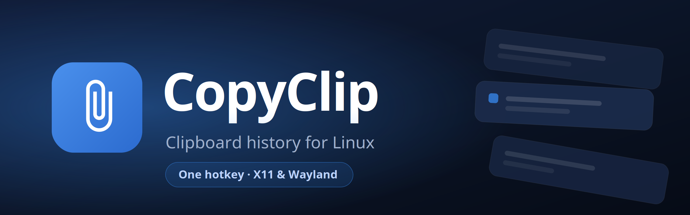
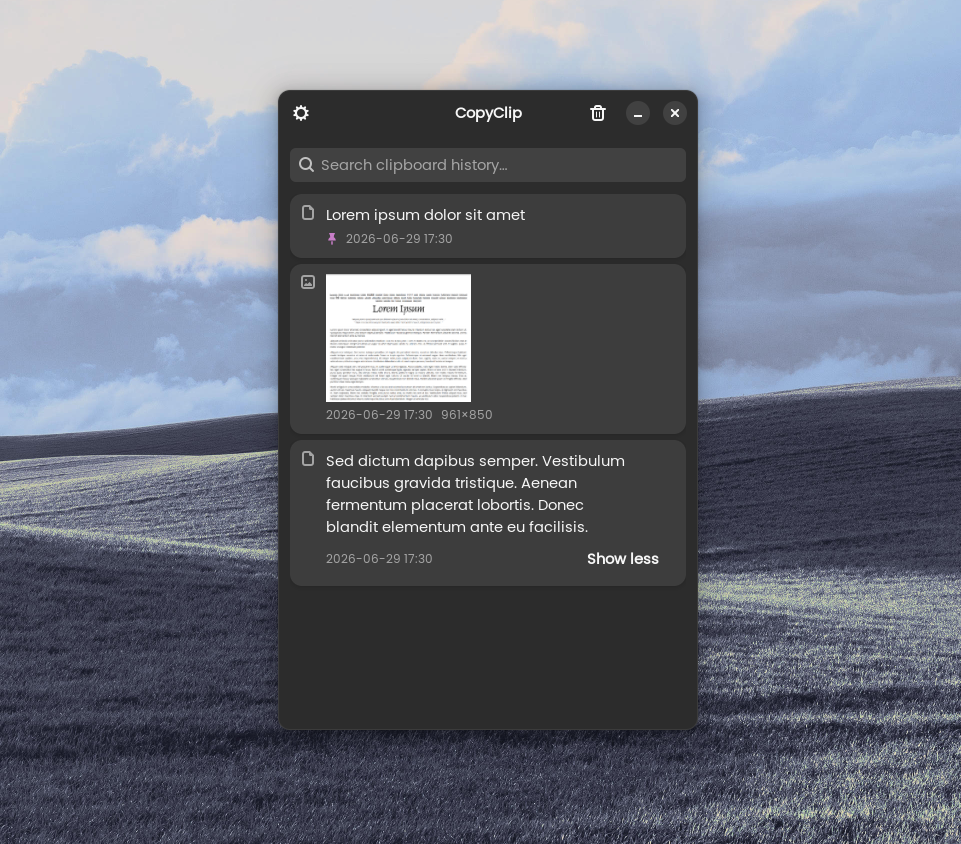
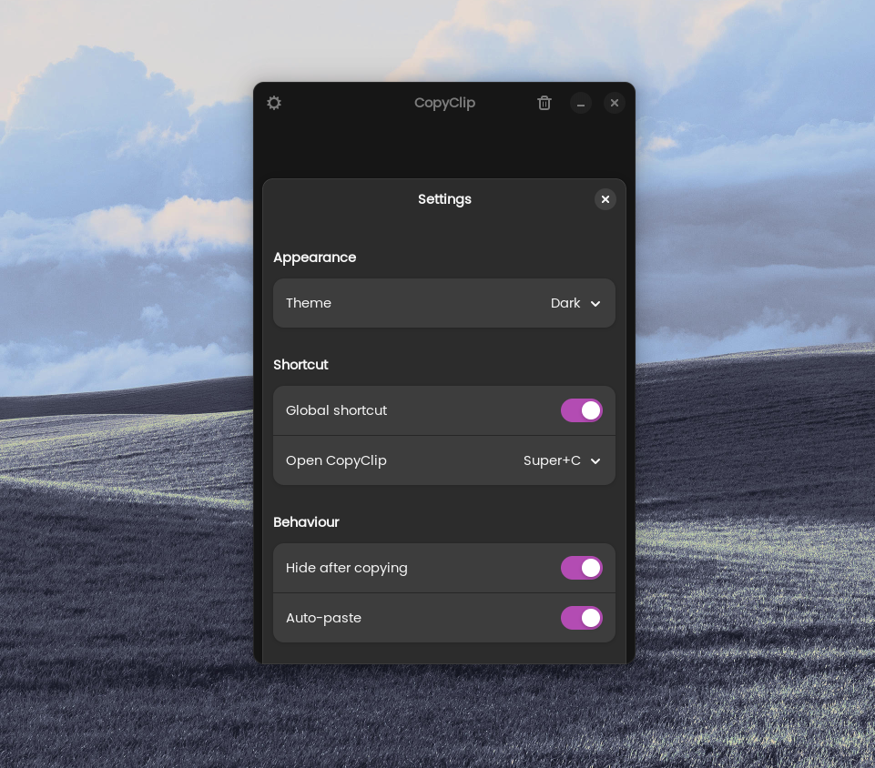
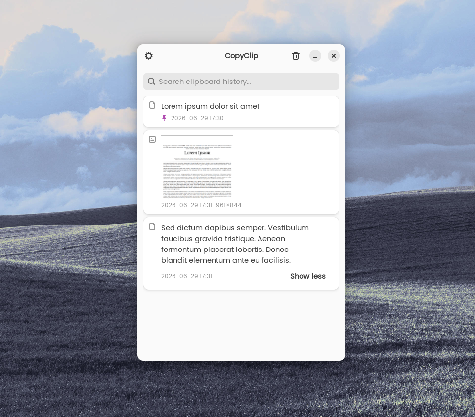
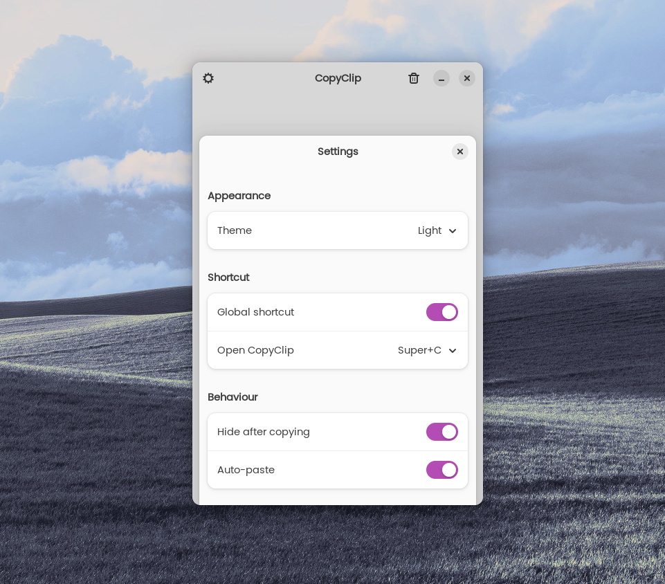

<div align="center">



[](LICENSE)
[](https://github.com/Walkercito/CopyClip/releases)


[Features](#-features) • [Screenshots](#-screenshots) • [Install](#-install) • [Usage](#-usage) • [Contributing](#-contributing)

</div>

## 📸 Screenshots

<div align="center">

| Main window (dark) | Settings (dark) |
|---|---|
|  |  |

| Main window (light) | Settings (light) |
|---|---|
|  |  |

</div>

---

## What it is

CopyClip keeps a searchable history of what you copy — plain text, HTML, and images — and brings it back with one keypress. It is a native C++23 app with a GTK4 + libadwaita UI, rewritten from an earlier Python/PyQt6 version.

The reason it exists: the same global hotkey works on X11 and Wayland, with nothing to wire up by hand. The previous version made you bind a custom Wayland shortcut yourself. That step is gone. CopyClip reads the clipboard through the X11/XWayland selection, which the compositor mirrors to and from the Wayland clipboard, and pastes by injecting Ctrl+V through a `/dev/uinput` virtual keyboard — kernel-level, so it reaches terminals and sandboxed apps too.

Developed and tested on GNOME (Mutter), X11 and Wayland sessions. It is young software (v0.2.2) — expect rough edges on other desktops, and please file what you hit.

---

## 🚀 Features

| | |
|---|---|
| 🗂️ **History** | Captures text, rich text (HTML), and images or screenshots as you copy them, newest first. |
| 🖼️ **Image thumbnails** | Copied and pasted images render as thumbnails instead of raw byte counts. |
| 📌 **Pinning** | Pin the clips you reuse so they stay at the top. |
| 🔍 **Fuzzy search** | Start typing to filter the whole history. |
| ⌨️ **One hotkey, both servers** | A configurable shortcut (default `Super+C`) toggles the window on X11 and Wayland. |
| 📋 **Click to paste** | Click a clip to copy it, and optionally auto-paste it into the window you came from. |
| 🌗 **Themes** | Dark, light, or follow the system. |
| 💾 **SQLite storage** | History lives in a WAL-mode SQLite database with de-duplication and a configurable size cap. |
| 🪶 **Event-driven** | Capture is signal-driven, not polled, so it idles cheaply in the background. |

---

## 📦 Install

### One-line installer

```bash
curl -fsSL https://raw.githubusercontent.com/Walkercito/CopyClip/main/scripts/install.sh | bash
```

The script detects your distro and architecture and installs a `.deb` or `.rpm` when it can, falls back to an AppImage, and builds from source if neither fits. It also adds CopyClip to your login autostart.

To remove it:

```bash
curl -fsSL https://raw.githubusercontent.com/Walkercito/CopyClip/main/scripts/install.sh | bash -s -- --uninstall
```

### Build from source

<details>
<summary>Prerequisites and build steps</summary>

You need CMake ≥ 3.28, Ninja, a C++23 compiler, and vcpkg with `VCPKG_ROOT` exported. GTK4, libadwaita, gtkmm-4.0, Qt6, and libX11 come from your system, not vcpkg.

```bash
# Debian / Ubuntu
sudo apt install cmake ninja-build qt6-base-dev qt6-tools-dev libgl-dev \
             libx11-dev libgtkmm-4.0-dev libadwaita-1-dev
```

vcpkg pulls the rest (GoogleTest, spdlog, nlohmann-json, SQLiteCpp) from the manifest at configure time. Then:

```bash
git clone https://github.com/Walkercito/CopyClip.git
cd CopyClip
cmake --preset release
cmake --build --preset release
```

The presets are `debug`, `release`, and `asan`.

</details>

---

## 🔑 Runtime requirements

CopyClip needs GTK4 and libadwaita at runtime; both ship on current GNOME-based distros.

Auto-paste writes to `/dev/uinput`, which on most systems means joining the `input` group:

```bash
sudo usermod -aG input $USER
# log out and back in for the group to take effect
```

Without `/dev/uinput` access, paste falls back to `xdotool` on X11, or `wtype`/`ydotool` on Wayland, when one is installed. History capture and click-to-copy work either way; only the automatic paste-back depends on this.

---

## 🛠️ Usage

Launch `CopyClip` once and it stays running in the background. Press your hotkey to toggle the window, click a clip to copy it (and paste it back, if auto-paste is on), and hit `Esc` to hide. Type at any time to fuzzy-search.

Open **Settings** to change the theme, rebind the hotkey, toggle auto-paste and auto-hide-on-copy, and set the maximum history size.

To start hidden — for autostart entries — pass `--background`.

### Shortcuts

| Key | Action |
|---|---|
| <kbd>Super</kbd>+<kbd>C</kbd> | Toggle the CopyClip window (default; configurable) |
| <kbd>Click</kbd> | Copy the clip (and auto-paste if enabled) |
| <kbd>Ctrl</kbd>+<kbd>Click</kbd> | Pin / unpin a clip |
| Type | Fuzzy-search the history |
| <kbd>Esc</kbd> | Hide the window |

---

## 🔧 Configuration

CopyClip keeps its state under `~/.local/share/copyclip/`:

- `settings.json` — preferences
- `history.db` — the SQLite history database

Keys in `settings.json` include `theme`, `hotkey`, `max_history_items`, `auto_hide_on_copy`, `auto_paste`, and `first_run_completed`. The Settings dialog is the easier way to change most of them.

---

## 🤝 Contributing

The build is C++23 with CMake presets (`debug`/`release`/`asan`), Ninja, and vcpkg in manifest mode. `clang-format` and `clang-tidy` configs are committed, warnings are errors (`-Wall -Wextra -Wpedantic -Wconversion -Wshadow -Werror`), and a GoogleTest suite under an ASan+UBSan+LSan build gates merges. Read [CONTRIBUTING.md](CONTRIBUTING.md) for setup, the toolchain, and the commit conventions before opening a PR, and branch off `main` for feature work.

---

## 💖 Support

<div align="center">

<a href="https://buymeacoffee.com/walkercito"></a>
<a href="https://ko-fi.com/walkercito"></a>
<a href="https://www.paypal.me/KarlaMejiasArian"></a>
<a href="https://walkercitodev.vercel.app/donate"></a>

</div>

CopyClip is free and MIT-licensed. If it earns a spot in your workflow, a coffee or a ⭐ helps keep it maintained.

---

## 📄 License

MIT © 2024 Walkercito. See [LICENSE](LICENSE).
